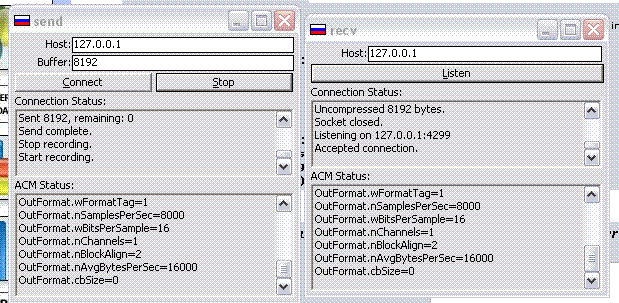

## Internet voice chat Source

### Description

This Code alows you the us the msacm32.dll and transmit voice over the internet. I would like to know if someone could show me how to use truespeec in it with out haveing to use the codec chooser thing.
 
### More Info
 

             |
---                |---
**Submitted On**   |2005-12-26 18:07:20
**By**             |[zoom](https://github.com/Planet-Source-Code/PSCIndex/blob/master/ByAuthor/zoom.md)
**Level**          |Intermediate
**User Rating**    |4.7 (14 globes from 3 users)
**Compatibility**  |VB 6\.0
**Category**       |[Internet/ HTML](https://github.com/Planet-Source-Code/PSCIndex/blob/master/ByCategory/internet-html__1-34.md)
**World**          |[Visual Basic](https://github.com/Planet-Source-Code/PSCIndex/blob/master/ByWorld/visual-basic.md)
**Archive File**   |[Internet\_v19599612262005\.zip](https://github.com/Planet-Source-Code/zoom-internet-voice-chat-source__1-63805/archive/master.zip)

